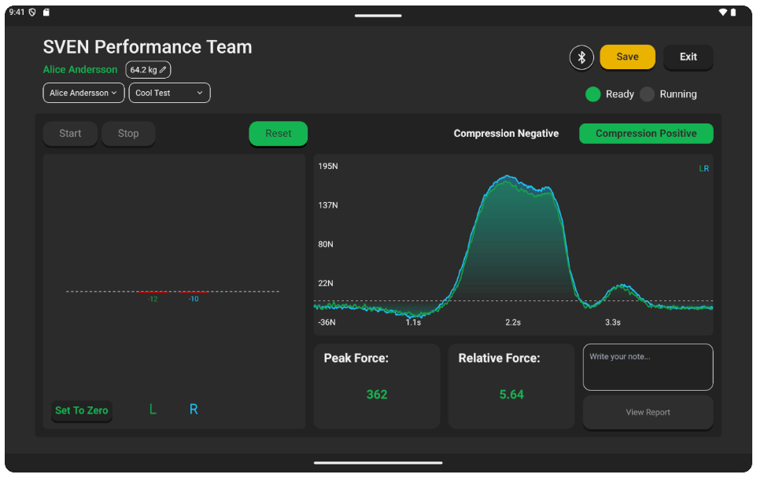
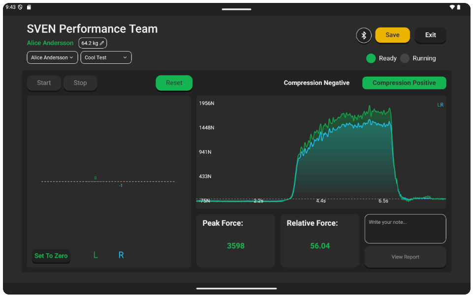
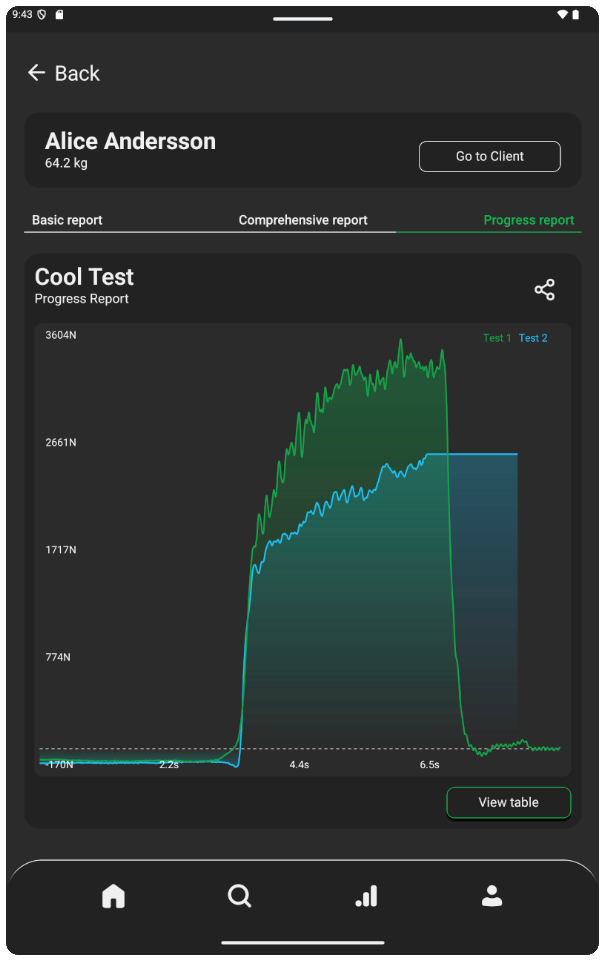

# SVEN
Contributed to the development of a prototype React Native Android application in collaboration with an independent entrepreneur as part of a university course project.
 
The application featured real-time Bluetooth Low Energy communication with custom hardware, enabling live data streaming and interactive graph visualization. Data was stored locally using SQLite, with a built-in analysis suite offering basic, comprehensive, and progression-based reports. Users could export reports as PDFs or raw data as CSV files.

My primary responsibility during the project was to handle communication with the proprietary BLE device, develop a working BLE emulator for development using Android Emulators, and an Asynchronous Data Saver (ADS) to properly handle race conditions during write operations while a test is ongoing. The motivation for the ADS was to never loose data in case something went wrong, which was a really important point specified by the project owner.

## Tech Stack

## Images

